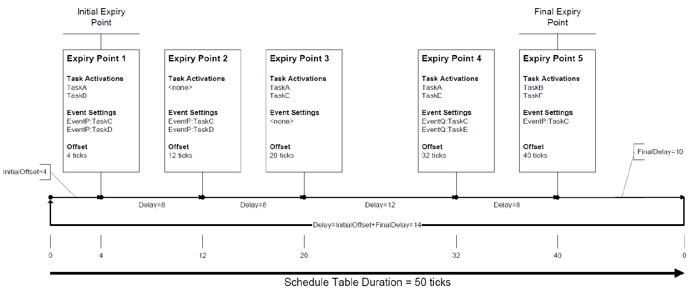
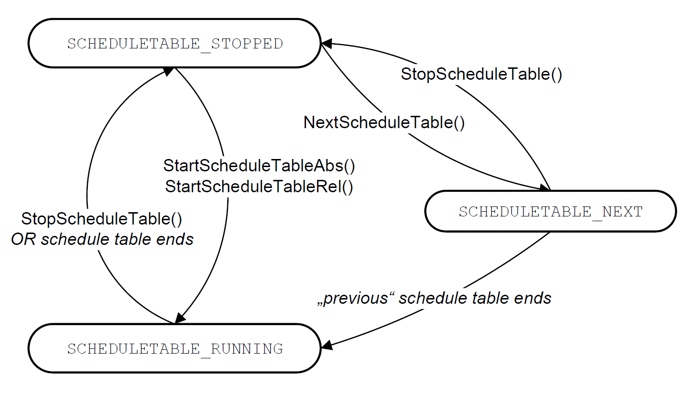

# Autosar Classic Platform ScheduleTable 调度表

## 周期任务调度概要
Autosar Classic Platform OS的周期任务均采用静态配置，它们的调度主要通过Alarm和ScheduleTable两种方式实现。
这两种方式均为时间触发，因此，需要依赖于系统时钟，通常由硬件计时器、驱动程序配合产生。
Alarm机制通常与任务数量一一对应，每个Alarm需要引用自身所在核心的系统时钟，当设定的时钟到来时，Alarm可激活任务。
因此，实现多任务调度时，每个核心需建立多个Alarm用于任务激活。

ScheduleTable机制则通过构造调度表，表中设置到期点（Expiry Points），每个到期点挂载多个任务，当时钟到达到期点时，激活这些任务。
每个调度表均需要绑定到一个系统时钟上，单个系统时钟可驱动多个调度表。
一个周期任务只能绑定在一个调度表中，但调度表可以管理多个周期任务。

调度表和Alarm有如下特点：

| 特性 |	调度表（Schedule Table）|	报警器（Alarm）|
| --- | --- | --- |
| 任务管理	| 支持多任务管理 | 仅支持单任务管理 |
| 同步机制	| 支持调度表之间的同步	| 不支持复杂同步机制 |
| 配置复杂度 |	复杂 |	简单 |
| 资源占用	| 较高（每个调度表需要一个计数器）|	较低（每个报警器需要一个计数器）|
| 时间精度	| 高 |	依赖于计数器的精度 |
| 适用场景	| 多任务、严格时间同步、短周期任务 |	单任务、独立任务、长周期任务 |


## 调度表的基本原理
#### 基本执行
如图1所示，调度表中存在多个偏移量（Offset）不同的到期点，到期点钟可以挂在多个周期任务或者事件任务。
系统执行时，时钟到达任意到期点的偏移量，即可激活到期点钟的任务执行。

<div align="center">
    
    <div>图1 调度表基本原理</div>
</div>

#### 调度表类型
单发（single-shot）：调度表按顺序处理每个到期点，然后在末端到期点执行完后停止。这对于在响应某个触发事件时触发分阶段的动作序列非常有用。

重复（repeated）: 调度表依次处理每个到期点，在处理完最后一个到期点后，它会回绕至初始到期点。这对于构建执行重复处理的应用程序或需要将处理与驱动源同步的系统非常有用。

### 周期任务执行模型

#### 到期点偏移量设置
利用重复调度表，可调度执行周期任务。假定存在$n$个周期任务，它们的周期分别为$t_1,t_2,...,t_n$。可求得调度表的周期为所有任务周期的最小公倍数$lcm(t_1,t_2,...,t_n)$。
因此，对于所有任务到期点的偏移量$Offset$（假定调度表起始点为0）可按如下代码求得
```
struct ExpiryPoint {
    int offset;
}

ExpiryPoint ep[MAX_NUM_EP];
int NumExpiryPoint = 0;

T = lcm(t_1,t_2,...,t_n);
for(time = 0; time < T; time++) {
    for(int i = 1; i < n; i++) {
        if(time % i == 0) {
            ep[NumExpiryPoint++].offset = time;
        }
    }
}
```

#### 多个优先级相同的任务
调度表实质上只是给与调度器按时间触发激活某个到期的任务，任务是否发生抢占依然需要靠任务优先级进行决定。而对于多个到期的同优先级任务的调度，通常由两种调度规则决定：

- 时间片轮转（Round-Robin, RR）：为每个任务分配固定时间片，当时间片用尽时，当前任务挂起，下一个任务开始执行。
- 先进先出（First in first out, FIFO）：按照就绪顺序，先就绪的任务先执行。

#### 多个调度表
如果同一核心上存在多个调度表，其执行顺序是由OS的调度策略和调度表的配置决定，可以多个调度表并发执行。调度表中任务执行顺序依然由到期时间和优先级决定。具体表现：

- 调度表启动顺序：
  + 显示启动：按照配置需求，可调用 StartScheduleTable API 启动调度表。
  + 隐式启动：通过同步机制自启动调度表
- 调度表优先级：
  + 调度表没有优先级
  + 调度表的执行顺序由任务的触发顺序和优先级决定
- 调度表的同步：
  + 多个调度表需要同步时，需使用同步机制如同步信号或计数器）来协调它们的启动和停止。
  + 如：调度表A需要在B和C完成后启动。

根据上述内容可知多个调度表的执行模式：多个调度表可并发执行，调用StartScheduleTable启动A、B两个调度表后，各自时钟开始计时，当A调度表中有到期点触发后，调用优先级最高的任务执行。如果B调度表中任务到期，且比A调度表中正执行的任务优先级高，就会发生抢占。如果调度表C需要在B完成后执行，则需要设置同步点，在B完成后启动调度表C。


### 调度表的设计
本节将按照AUTOSAR SWS OS Spec 7.3和7.4进行设计

#### 调度表结构设计
- 到期点数据结构：Spec规定调度表中至少有1个到期点[SWS_Os_00401]，因此需要设计管理到期点的数据结构，由于到期点存在顺序，且预先配置，可使用数组等顺序结构。
- Initial Offset：初始偏移量，即调度表中第一个到期点的偏移量，值可以设置为0。
- Duration：从0开始到调度表停止前的Tick数
- Final delay：最后一个到期点的偏移量与Duration之间的差值。
- Delay：到期点之间的tick数，等于后一个到期点的偏移量减去前一个到期点到期点的偏移量。如果是重复调度表，那么当前轮次最后一个到期点与下一轮第一个到期点的delay等于Final delay加上Initial Offset。
- timer：用于时间触发的定时器

仿真器中利用timerfd为调度表提供时钟，具体结构设计如下
```
struct ScheduleTables {
    int initial_offset;
    int duration;
    int final_delay;
    int current_delay;
    int period;
    int fd;                     // time fd
    struct EntryPoint ep[MAX_NUM_EP];
};
```

#### 到期点的结构
- 所管理的周期任务集合：以优先级排序的顺序结构，管理的是代表任务的结构，可以是任务控制块等（可为空）
- 所管理的事件任务集合（可为空）。
- 从调度表起始点开始的Tick偏移量

```
struct EntryPoint {
    int offset;
    int task_num;
    int event_task_num;
    Task task[MAX_NUM_TASK];
    Task event_task[MAX_NUM_TASK];
};
```
  
#### 到期点的约束
- 所定义的到期点不能为空，即到期点必须至少要有1个周期任务或1个事件任务。且必须确保调度表上的到期点总是有序的，该顺序由强制要求每个到期点必须由唯一的偏移量所维护，并且必须告知OS。[SWS_Os_00407]
- 每个到期点应该有唯一偏移量，该偏移量由AUTOSAR计数器驱动。[SWS_Os_00442]
- 到期点偏移量应从0开始，且不得超过操作系统允许的最大Tick。[SWS_Os_00443]
- 延迟数也应该在[OsCounterMinCycle, OsCounterMaxAllowedValue]范围内。[SWS_Os_00408]

总之，到期点结构的三个变量均是有约束的，尤其是偏移量，从仿真器实现的角度，并不会用Tick的实现偏移量，可改为更为方便的时间，当然，精度可能会下降。

#### OS对调度表的处理
- 顺序性：操作系统模块应从第一个到期点到最后一个到期点，按顺序处理调度表中的每一个到期点。[SWS_Os_00002]
- 并发性：操作系统允许多个调度表并发处理。[SWS_Os_00007]
- 操作系统模块的一个调度表应由一个计数器（时钟）驱动。[SWS_Os_00409]
- 在任意时刻，操作系统模组应至少处理由一个计数器驱动的调度表。[SWS_Os_00410]
- 时钟一致性：操作系统应使用tick确保调度表中偏移量的tick与计数器的tick一致。[SWS_Os_00411]
- 激活任务和设置事件的顺序：如果到期点包含激活任务并设置同一任务的一个或多个事件的操作，则操作系统模块应先激活任务再设置相关事件。[SWS_Os_00412]

非同步调度表的状态：
- SCHEDULETABLE_STOPPED：表示状态表未活动，操作系统没有对它进行处理。
- SCHEDULETABLE_RUNNING：一旦设置成该状态，操作系统将开始处理调度表中的到期点。
- SCHEDULETABLE_NEXT：当操作系统处理的调度表被切换，该调度表将被设置成该状态，直到当前调度表（切换后的新调度表）结束。

非同步调度表的状态转换和所使用的API如图2所示
<div align="center">
    
    <div>图2 非同步调度表状态转换</div>
</div>

