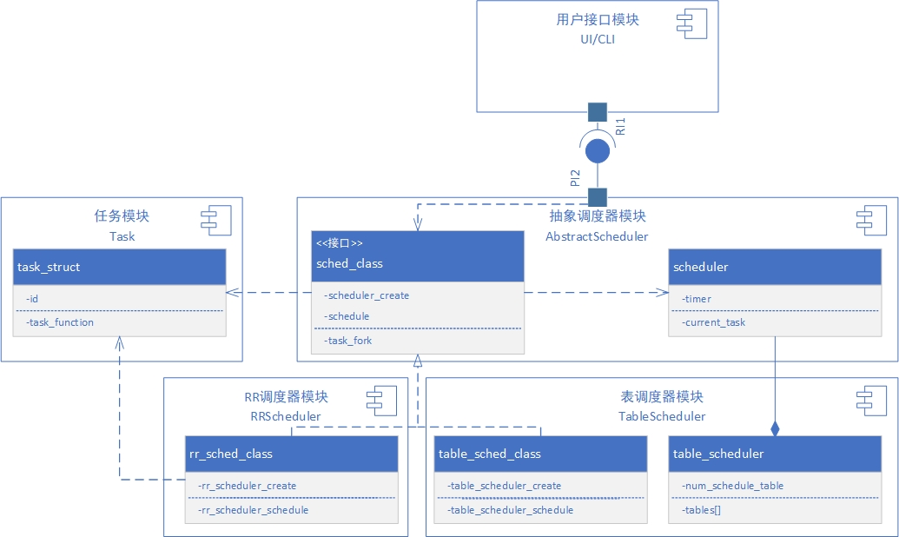

# 软件架构

## Overview
本项目围绕 **AUTOSAR Classic Platform 的任务调度模型** 构建，用于仿真AUTOSAR Classic Platform中任务调度和任务执行流程。项目采用模块化设计，其核心逻辑主要由四个关键模块组成：

- ✅ 任务模块（Task）
- ✅ 抽象调度器模块（Abstract Scheduler）
- ✅ 表调度器模块（Table Scheduler）
- ✅ 用户接口模块（User Interface）

## 模块简介

### 1. 任务模块（Task）

* 描述任务的基本属性，如周期、偏移、类型（周期/单发）、优先级等
* 支持任务调度状态更新（激活/运行/完成）
* 可扩展为支持资源依赖、事件触发等高级模型

### 2. 抽象调度器模块（Abstract Scheduler）
抽象调度器模块用于处理任务管理中的不变量，一方面为上层的软件提供统一的调度方法接口定义，另一方面用于描述任务调度的行为。具体作用如下：

* 作为所有调度器的基类，定义统一的调度接口
* 提供调度器生命周期管理（初始化、启动、终止）
* 保持调度器（不同调度算法的调度器）之间的可替换性

### 3. 表调度器模块（Table Scheduler）
符合AUTOSAR Classic 平台规定的调度器实现，具体特性为：

* 实现时间驱动调度（Time-Triggered Scheduling）

* 支持多个调度表的管理、切换与执行

* 每个调度表包括一系列任务启动事件（时间戳 -> 任务）

###  4. 用户接口模块（UI/CLI）
仿真器的用户接口，提供UI界面或者CLI方式启动仿真，具体特性为：

* 加载任务与调度表配置（如 ARXML或其他格式）
* 提供命令行入口或图形界面入口
* 控制调度过程（如执行步进、重置仿真、导出调度结果）
* 提供调度结果的图形和数据输出
* 提供对输出结果的分析

## 模块间的交互示意
图1展示了软件模块之间的关系。

* 用户接口模块：仅与抽象调度器模块交互。通过调用由抽象调度器模块提供的接口实现用户仿真功能。
* 抽象调度器模块：向上为用户接口模块提供任务管理相关接口，向下定义调度器属性和行为的通用抽象。采用调度器和调度方法的分离设计，其中调度器类定义描述通用调度器的属性，调度方法类定义统一任务管理行为和接口。调度方法会依赖（Dependency）于调度器类。
* 具体调度器模块：调度器的具体实现。具体调度器类定义相关调度器实现的属性描述，除去定义特殊属性还会通过组合（Composition）抽象调度器获取通用属性。具体调度方法类用于实现具体调度器的相关方法，是通用调度器方法的具体实现（implements）。具体调度方法通过抽象调度方法调用具体调度器类。
* 任务模块：主要定义任务的属性和任务执行相关的方法。其中描述任务的task_struct会被调度方法类所依赖（Dependency）。

    
    
图1 软件模块以及模块内部关键类之间的关系

