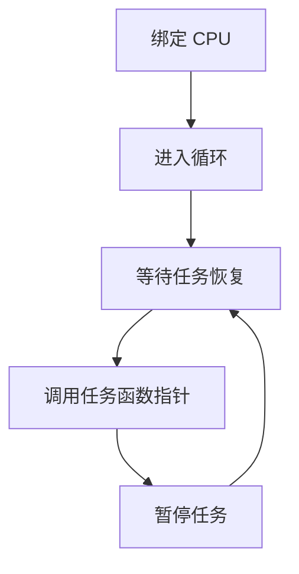
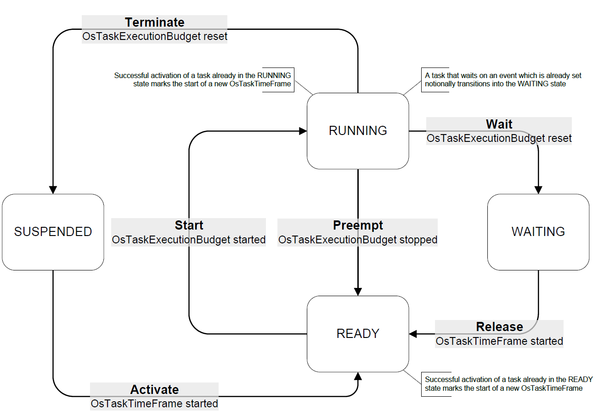

# 软件模块设计

本项目依照AUTOSAR Classic Platform标准，基于面向对象的设计思想进行软件设计。项目的基本架构[`基本架构`](architecture.md)自顶向下被设计成了用户接口模块（UI/CLI）、抽象调度器模块（Abstract Scheduler）、任务模块（Task）和表调度器模块（Table Scheduler）。通过四个核心模块的配合，完成“加载配置 → 启动仿真 → Tick 驱动 → 表查找任务 → 执行调度决策 → 记录仿真日志与结果 → 分析结果”的仿真业务流程。

## 一、抽象调度器模块（Abstract Scheduler）

### 基本设计思路

任务管理的主要业务是负责任务的生命周期管理、执行状态更新和调度行为支撑。整个业务流程会根据具体所遵循的任务执行规则、所选择的调度策略发生变化。例如，AUTOSAR Classic OS要求设计时静态配置任务，不会在运行时创建新任务，它不会直接向用户或者其他操作系统模块提供诸如fork或者CreateTask类似的函数或方法。相反，很多通用操作系统或者支持动态创建任务的RTOS均提供这类方法。而具体的调度算法则会影响调度器在执行过程中的任务选择方式。因此，需要划分任务管理过程中的不变量和变量，以应对不同更为广泛的情况和需求变化。

抽象调度器模块就是用来处理任务管理过程中的不变量，它反映了任务管理向外提供的基本功能和流程，不受具体规范、调度方法制约。这种不变量包括：

#### 1. 统一的调度接口规范
所有调度器都必须实现/遵守以下标准方法：
| 方法名                       | 说明                       |
| ------------------------- | ------------------------ |
| `load_tasks(tasks)`       | 注册调度任务集                  |
| `load_schedule(schedule)` | 加载调度策略（如调度表）             |
| `tick(current_time)`      | 推进一个仿真时间片，执行一次调度         |
| `run(until_time)`         | 从当前时间运行到给定时间             |
| `reset()`                 | 重置调度器状态                  |
| `get_state()`             | 查询当前调度状态（调度表、任务状态、当前时间等） |
这些接口定义了调度器的基本控制语义，无论调度策略如何变化，系统的调用方都可统一操作调度器。

#### 2. 通用调度生命周期逻辑
不受调度策略影响的调度流程：
```
Init → Load → Run(tick by tick) → Stop/Complete
```
每个 tick 中应完成的共通动作：

* 时间推进（全局仿真时钟 + 本地调度器时间）

* 检查是否应激活任务以及如何选择要激活的任务（由子类调度逻辑决定）

* 调用任务管理模块处理激活/执行状态

* 记录调度结果（如调度日志、统计信息）

#### 3. 系统级行为约束（行为契约）
无论调度策略如何，抽象调度器层面必须维护：

* 调度器对任务的“只调度已注册任务”

* 任务状态推进应是确定性的

* tick 推进必须是线性的（不可跳跃时间）

* 不可在未加载任务/调度表的情况下运行调度器

* 调度器必须对外提供可追踪的状态输出（用于测试或日志）

这些约束构成了调度器的行为基线，防止因策略多样导致系统逻辑不可控。


抽象调度器模块定义了调度器必须具备的接口规范、统一执行流程与系统一致性约束，是仿真系统中“策略无关逻辑”的统一入口。


### 数据结构设计

* scheduler 结构：描述调度器，包含调度器的通用属性，如 tick时钟、所在CPU、注册的任务等。
* sched_class 结构：定义调度器用于管理所提供的方法，包括调度器自身的管理和对任务的管理，如 创建/销毁/启动调度器，执行调度，任务入队等。结构中所有方法均为函数指针，由子类调度逻辑实现并进行注册。

### 方法设计
参考API 文档

## 二、表调度器模块（Table Scheduler）

负责实现AUTOSAR Classic平台规定表调度任务管理。

### 基本设计思路

#### 1. 调度器执行模型
根据AUTOSAR Classic Platform标准，存在三种情况会进入调度点：
* （1）时钟响应：表调度是一个由时间触发的调度机制，每个到期点需要进入调度点调度任务。
* （2）优先级选择：在相同到期点时，需要按优先级顺序选择任务
* （3）事件响应：事件任务、中断等会以事件响应的形式进入调度点。
这三类调度点中均存在多钟触发情形，例如，不同的中断源会导致不同的中断处理。为了能统一处理，调度器的执行模型设计为：每个线程一个调度循环配合epoll IO多路复用(one schedule loop per thread + epoll IO multiplexing)。
具体为每个调度器在其所管理的CPU上开辟一个loop线程（非阻塞IO线程），并将不同的调度触发点注册给epoll，按类型对调度点进行处理。

#### 2. 调度表设计
为了满足表调度的顺序性，设计到期点数组，用于保存到期点对tick时钟的相对偏移，并利用到期点数组按顺序不断更新到期时钟，使得仿真器可以从第一个到期点到最后一个到期点，按顺序处理调度表中的每一个到期点中的任务（符合SPEC [SWS_Os_00002]）。

为了支持同一个调度器上多个调度表的并发执行，为每一个调度表分配一个tick时钟（符合SPEC [SWS_Os_00409]、[SWS_Os_00410]、[SWS_Os_00411]），并将时钟事件注册给epoll。在事件循环中，到期就会执行该调度表上对应到期点的任务。当多个调度表存在同一到期点，epoll_wait 返回多个事件，并进行响应处理（符合[SWS_Os_00007]）。

#### 3. 任务调度时机

根据AUTOSAR Classic平台的表调度机制，存在至少三种调度时机：
+ 任务结束后主动调度：任务函数结束后，任务线程调用terminate函数唤醒调度器，主动让出CPU核心给调度器并引发调度。
+ 时钟到期后调度：到达到期点时钟，调度器由定时器中断唤醒，抢占当前任务，并引发调度。
+ 中断抢占：中断任务到达，抢占当前任务，引发调度。

本项目统一由调度器来触发调度，即在切换任务之前，均会由调度器抢占CPU，并决定下一个任务的选择。这种设计的好处：
* 方便管理：不论中断源、事件源的数量是多少，均会汇流到调度器程序进行统一管理。
* 方便实现：线程之间的抢占均通过设置优先级交由内核调度器实现，用户空间无法用合适方式非侵入式的抢占线程。然而，线程交由内核控制抢占，延迟和执行行为难以控制，且为每个线程分配内核调度器相关的优先级对于仿真器的实现没有必要。因此，不如将调度器设置成最高抢占优先级，使其能够抢占所有任务线程，然后，任务线程的执行选择均由调度器决定。

为了在调度器执行模型下实现这三种调度时机，设计了两类epoll事件：
+ 边沿事件模拟抢占：中断、事件任务、任务结束均可被注册成epoll边沿事件，通过写入数据触发事件，并在调度器中引发对应响应。
+ 时钟事件：将时钟的timer fd注册给epoll，并在调度器中处理对应事件响应。

另外，为了保证任务调度的效率和易于实现，任务结束后主动调度，根据就绪队列中任务优先级选择任务，并使用对应的条件变量唤醒任务，实现任务切换。
而抢占切换则完全交给Linux内核调度器，把仿真器的调度器线程设置为最高优先级，满足调度时机后，仿真器调度器抢占CPU，并决定调度。被抢占的任务线程会放入仿真器的就绪队列，一旦决定执行该任务，同样会使用条件变量唤醒，由内核调度器恢复。

这种设计方式也存在缺点，<span style="color:red">会提高中断响应和任务切换的延迟</span>（未来可能会优化这种调度执行方式）。

### 数据结构设计

* table_scheduler 结构：用于描述表调度器，包含表调度器实现所需的相关属性，如 调度表数组，epoll相关属性和通用调度器结构等。
* schedule_table 结构：用于描述调度表，包含描述调度表所需的相关属性，如 时钟、时间约束参数（如 初始偏移、最终延迟、执行时长[SWS_Os_00009]、[SWS_Os_00427]、[SWS_Os_00444]、[SWS_Os_00194]）、表上的到期点数组（[SWS_Os_00401]）、调度表类型（[SWS_Os_00413]）、调度表状态等。
* expiry_point 结构：用于描述到期点，包含描述到期点的相关属性，如 到期点相对于调度表起点的偏移量（[SWS_Os_00407]、[SWS_Os_00442]、[SWS_Os_00443]），到期点上的任务队列等。
* event_table_node 结构：用于描述epoll事件节点，包含相关属性，如 事件的fd、所在链表、事件处理函数和函数的参数结构等。


## 三、任务模块设计

### 基本设计思路

#### 1. 任务实体
任务实体采用linux pthread线程进行模拟，以模拟出上下文切换，但可能存在上下文切换开销过大问题。未来会使用用户态线程库进行替代。


#### 2. 任务接口统一
设计统一的函数指针作为接口绑定具体任务，并设计统一任务接口作为任务线程的执行函数，再由接口内部通过函数指针调用不同的具体任务。根据任务类型不同，基本流程为：
* 单发任务：绑定cpu -> 等待任务启动 -> 调用任务函数指针 -> 终止任务
* 周期任务：


#### 3. 任务状态转换

AUTOSAR Classic平台OS标准定义了任务状态转换，以及相关API函数，如图1所示
  + RUNNING：该任务正在运行，任何时刻一个CPU core上只有一个任务是RUNNING的。
  + READY：任务已经准备就绪，随时可以被调度器选择执行，一旦被选择执行，任务将会转换成RUNNING。对于AUTOSAR的表调度来说，只有到期点上的任务或者被抢占的任务才是READY的。
  + SUSPENDED：任务被挂起，此时无法被调度器选择执行，必须被激活后才能选择。
  + WAITING：等待EVENT的任务。

<div align="center">
    
    <div>图1 AUTOSAR任务的状态转换</div>
</div>

为了实现图1中的AUTOSAR任务状态转换，采用如下设计思路：
- 任务创建和结束（包括周期任务在本周期中执行完成后的暂停）均被设置为SUSPENDED
- 用一个就绪队列维护READY状态的任务，所有到达到期点的任务（SUSPENDED -> READY）以及被抢占的任务（RUNNING -> READY）均被设置为READY状态。
- RUNNING：调度器从就绪队列中选中将要执行的任务会被设置成RUNNING（READY -> RUNNING）。
- WAITING：<font color="#dddd00">暂时不考虑支持，后续看情况和进度。</font><br /> 
- RESUMING：恢复RUNNING前的中间状态，用于更精确判断被抢占时任务的执行状态，属于为了方便实现引入的附加状态。

### 数据结构设计
task_struct 结构：用于描述任务，包含的属性包括：线程id、任务所在cpu、优先级、是否被抢占、状态、类型、所在调度器等
task_struct_info 结构：描述任务信息，主要是从外部接收静态设计中的任务信息，然后通过该结构传递这些信息给task_struct结构。信息包括：优先级、所在cpu、周期、表id等。

