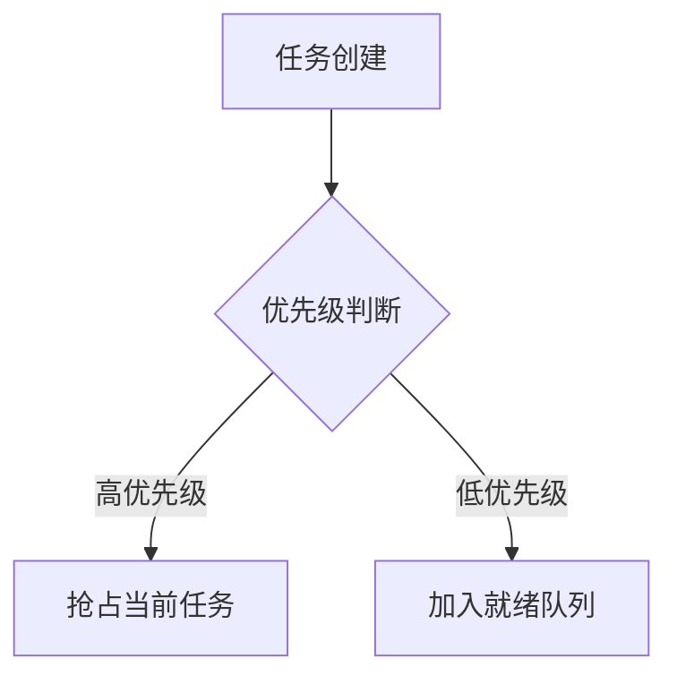

# Architecture-Evolution-for-ECU

I try to show the architecture evolution for the software of automotive electronic controller unit


# My RTOS Project - 轻量级实时操作系统

 <!-- 可选 -->

## 项目概述

- **目标**：实现一个符合 AUTOSAR OS 理念的抢占式实时调度器
- **核心特性**：
  - ✅ 多优先级任务调度（0-255 级）
  - ✅ 时间片轮转算法
  - ✅ 栈溢出检测机制
  - ✅ SysTick 驱动的抢占式调度

## 目录结构

```bash
.
├── src/            # 源代码
│   ├── main.c      # 系统入口
│   └── startup.s   # 汇编启动文件
├── docs/           # 设计文档
├── README.md       # 你现在看到的文件
└── Makefile        # 编译配置
```

## 架构设计

### 任务管理模块

```c
typedef struct {
    uint32_t *stackPtr;  // 当前栈指针
    uint8_t priority;    // 任务优先级
    // ...
} Task;
```

- **设计思路**：采用 TCB 结构体管理任务状态，通过`task_create()`动态初始化

### 调度算法

| 策略       | 实现方式               | 适用场景           |
| ---------- | ---------------------- | ------------------ |
| 优先级调度 | 遍历选择最高优先级任务 | 实时性要求高的任务 |
| 时间片轮转 | SysTick 中断触发切换   | CPU 密集型任务均衡 |

## 快速开始

### 编译运行

```bash
make build   # 编译项目
make flash   # 烧录到目标板
```

### 添加新任务

```c
void my_task(void) {
    while(1) {
        os_delay(100); // 延迟100ms
    }
}

int main() {
    task_create(my_task, 2, 20); // 优先级2，时间片20ms
}
```

## 设计文档

- [系统架构图](docs/architecture.pdf)
- [AUTOSAR OS 规范参考](docs/autosar_os_spec.md)

## 贡献指南

1. Fork 本仓库
2. 创建特性分支 (`git checkout -b feature/xxx`)
3. 提交修改 (`git commit -am 'Add some feature'`)
4. 推送到分支 (`git push origin feature/xxx`)
5. 提交 Pull Request

## 许可证

[MIT License](LICENSE) © 2024 Your Name



[API 文档](docs/html/index.html)
